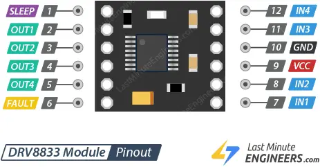

# 麦轮

## 芯片

### DRV8833 * 2

VCC和GND是连接驱动电机的电源的地方，电压范围为 2.7V 至 10.8V。

电机1 输入为IN1和IN2 输出为OUT1 和 OUT2  
电机2 输入为IN3和IN4 输出为OUT3 和 OUT4
|  IN1/IN3   | IN2/IN4  | 旋转方向 |
|  ----  | ----  | ---- |
| 0  | 0 | 电机关闭 |
| 1  | 0 |   向前 |
| 0  | 1 |   向后 |
| 1  | 1 | 电机关闭 |

输入的引脚通过pwm控制电机速度

公共地

### PCA9685
16路pwm驱动板
通过I2C通讯

### ESP8266

通过I2C通讯s

## 供电

2s电池
7.4v 

摄像头 12v gnd

8266 3.3v gnd

16pwm  3.3v 5v gnd

DRV8833 5v gnd pwm

D1连接模块的SCL
D2连接模块的SDA